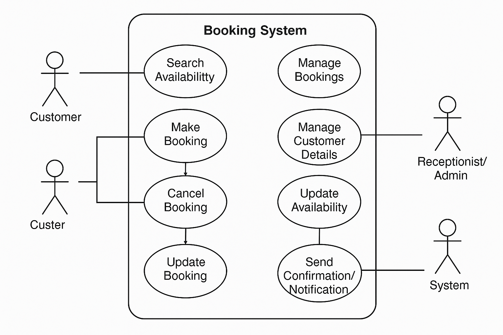

# Requirement Analysis in Software Development.

# What is Requirement Analysis?
# Definition of Requirement Analysis
Requirement Analysis is the process of identifying, documenting, and validating the needs and expectations of stakeholders for a software system. It serves as a blueprint that ensures developers, designers, and business teams have a shared understanding of what the system should achieve.

# Importance in the Software Development Lifecycle (SDLC)
Requirement Analysis is a critical phase in SDLC because it:

Defines Clear Objectives – Establishes what the system must do, reducing ambiguity.

Minimizes Errors Early – Identifies issues before development begins, preventing costly fixes later.

Enhances Communication – Acts as a bridge between stakeholders and developers, ensuring alignment.

Optimizes Time & Cost – Streamlines development by providing clarity, avoiding delays and budget overruns.

How It Ensures Project Success
Understanding Project Requirements

Helps translate user needs into technical specifications.

Ensures developers build features that match stakeholder expectations.

Minimizing Errors

Poorly defined requirements can lead to rework, which increases costs.

Requirement validation prevents issues from carrying over into later stages.

Successful Development Execution

Leads to structured project planning and efficient resource allocation.

Well-documented requirements allow seamless transitions between development phases.

Industry Example: Boeing’s Software Failure
Boeing’s 737 MAX faced severe software requirement misalignment, leading to tragic failures. The aircraft’s automated system had design flaws due to unclear requirements, which resulted in unexpected behavior. Lesson learned: Requirement Analysis could have flagged potential risks before development.

# Why is Requirement Analysis Important?

# Three Key Reasons Why Requirement Analysis is Vital in SDLC
# Prevents Miscommunication

Requirement Analysis ensures a clear understanding between developers, stakeholders, and users.

Without a structured approach, teams may misinterpret project needs, leading to conflicts and unnecessary revisions.

Example: In a banking system, failure to define security protocols properly can result in compliance issues and misaligned user expectations.

Enhances Project Efficiency

Proper requirement analysis helps teams plan resources, allocate budgets, and identify potential risks before development begins.

Developers can focus on building essential features rather than wasting time on unclear requirements.

Example: In the e-commerce industry, thorough requirement analysis ensures seamless integration between payment gateways, preventing costly errors.

Reduces Cost and Time Waste

Fixing requirement issues later in development is significantly more expensive than addressing them early.

Poorly defined requirements lead to rework, delays, and budget overruns.

Example: The failure of healthcare.gov was largely due to mismanaged requirements, causing excessive rework and a strained budget.

# Requirement Analysis in Software Development

## Why is Requirement Analysis Important?

Requirement Analysis is a **crucial phase** in the Software Development Lifecycle (SDLC). It ensures that project requirements are clearly defined and properly understood before development begins. Below are three key reasons why Requirement Analysis is critical in SDLC:

### 1. Prevents Miscommunication  
Requirement Analysis bridges the gap between stakeholders, developers, and end-users, ensuring a **shared understanding** of project goals.  
- Without well-defined requirements, developers may interpret needs differently, leading to inconsistent implementations.  
- Miscommunication often results in unnecessary revisions, causing delays.  

📌 *Example:* In enterprise software development, missing critical business requirements may lead to a product that does not align with user expectations, forcing costly rework.

### 2. Enhances Project Efficiency  
Proper Requirement Analysis allows teams to **plan resources, schedule development, and identify potential risks** before coding begins.  
- Ensures that development efforts remain **focused** on essential features.  
- Improves project planning by setting clear milestones and deliverables.  

📌 *Example:* In the fintech sector, precise requirement analysis helps streamline payment system integrations, avoiding regulatory violations and compliance errors.

### 3. Reduces Cost and Time Waste  
Fixing requirement errors late in development can be **extremely expensive** and lead to project failures. Requirement Analysis ensures that potential issues are identified **before** coding starts.  
- Avoids unnecessary expenses related to rework.  
- Prevents delays caused by unforeseen technical challenges.  

📌 *Example:* The failure of the Denver Airport baggage system was due to poor Requirement Analysis, causing **years of delay and excessive budget overruns**.

# Key Activities in Requirement Analysis

Requirement Analysis involves several structured activities that help define, document, and validate software requirements. Below are the five key activities in this process:

## 1. Requirement Gathering  
Requirement Gathering is the process of collecting information from stakeholders to understand their needs and expectations.  
- Involves interviews, surveys, and workshops.  
- Ensures all necessary requirements are identified before development begins.  

📌 *Example:* In an e-commerce project, gathering requirements from customers ensures the platform includes essential features like payment gateways and order tracking.

## 2. Requirement Elicitation  
Requirement Elicitation focuses on refining and clarifying gathered requirements.  
- Uses techniques like brainstorming, prototyping, and use case analysis.  
- Helps uncover hidden or unstated requirements.  

📌 *Example:* In a banking system, elicitation ensures security protocols are well-defined to prevent fraud.

## 3. Requirement Documentation  
Requirement Documentation involves structuring and recording requirements in a formal document.  
- Ensures clarity and consistency across teams.  
- Uses formats like Software Requirement Specification (SRS).  

📌 *Example:* A healthcare system requires detailed documentation to comply with regulations like HIPAA.

## 4. Requirement Analysis and Modeling  
Requirement Analysis and Modeling help visualize and structure requirements for better understanding.  
- Uses diagrams like flowcharts and use case models.  
- Identifies dependencies and potential conflicts.  

📌 *Example:* In a logistics system, modeling helps define interactions between warehouses, delivery agents, and customers.

## 5. Requirement Validation  
Requirement Validation ensures that documented requirements meet stakeholder expectations.  
- Involves reviews, testing, and feedback sessions.  
- Prevents costly errors before development begins.  

📌 *Example:* In a mobile app project, validation ensures user experience requirements align with customer needs.

# Types of Requirements in Software Development

Requirement Analysis involves identifying and categorizing different types of requirements to ensure a well-structured software system. Below are the two main categories:

## 1. Functional Requirements  
Functional Requirements define the **specific behaviors and functionalities** that the system must perform.  
- Describe what the system should do.  
- Include features, user interactions, and system responses.  

📌 *Example:* In a **booking management system**, Functional Requirements may include:  
- Users should be able to **search for available bookings**.  
- The system should allow **payment processing** for reservations.  
- Admins should be able to **approve or cancel bookings**.

## 2. Non-functional Requirements  
Non-functional Requirements define the **quality attributes** of the system, ensuring performance, security, and usability.  
- Describe how the system should operate.  
- Include scalability, reliability, and security constraints.  

📌 *Example:* In a **booking management system**, Non-functional Requirements may include:  
- The system should handle **1000+ concurrent users** without performance issues.  
- All user data must be **encrypted** for security compliance.  
- The booking process should complete within **3 seconds** for optimal user experience.

---

# Use Case Diagrams in Requirement Analysis

Use Case Diagrams are **visual representations** that illustrate how users (actors) interact with a system. They help define system functionalities and user interactions, ensuring clarity in requirement analysis.

## Why Use Case Diagrams Are Important  
- Provide a **clear overview** of system interactions.  
- Help identify **actors, use cases, and relationships** between them.  
- Ensure **stakeholders and developers** have a shared understanding of system behavior.  

## Example: Booking Management System  
Below is a Use Case Diagram for a **Booking Management System**, showcasing key interactions:

### **Actors:**  
- **Customer** – Books and manages reservations.  
- **Admin** – Approves or cancels bookings.  
- **Payment System** – Handles transactions.  

### **Use Cases:**  
- **Search for available bookings**  
- **Make a reservation**  
- **Process payment**  
- **Cancel booking**  

## Creating the Diagram  
Use tools like **Draw.io** or similar to design the Use Case Diagram.  
- Export the diagram as a **PNG file** (`alx-booking-uc.png`).  
- Link the image in the README.md file using markdown:

```markdown


---

# Acceptance Criteria in Requirement Analysis

Acceptance Criteria define the **conditions that a software feature must meet** to be considered successfully implemented. They ensure that requirements are clear, testable, and aligned with business goals.

## Why Acceptance Criteria Are Important  
- Provide a **clear definition of success** for each feature.  
- Help developers and testers understand expected outcomes.  
- Ensure alignment between stakeholders and development teams.  

## Example: Checkout Feature in a Booking Management System  
Below is an example of Acceptance Criteria for the **Checkout feature**:

### **Feature: Checkout Process**  
**Scenario 1: Successful Payment**  
- Given the user has selected a booking,  
- When they proceed to checkout and enter valid payment details,  
- Then the system should process the payment and confirm the booking.

**Scenario 2: Invalid Payment Details**  
- Given the user has selected a booking,  
- When they enter incorrect payment details,  
- Then the system should display an error message and prompt for correction.

**Scenario 3: Booking Confirmation**  
- Given the payment is successful,  
- When the system processes the transaction,  
- Then the user should receive a confirmation email with booking details.

---


